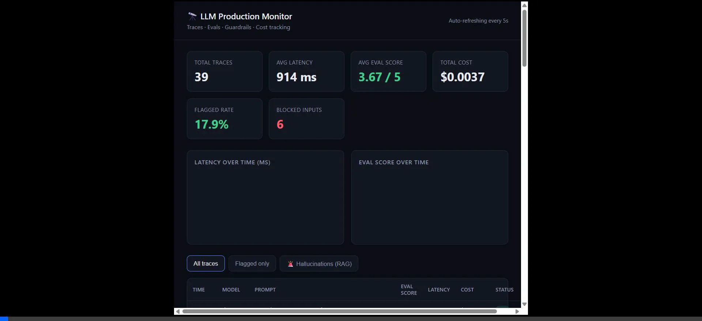
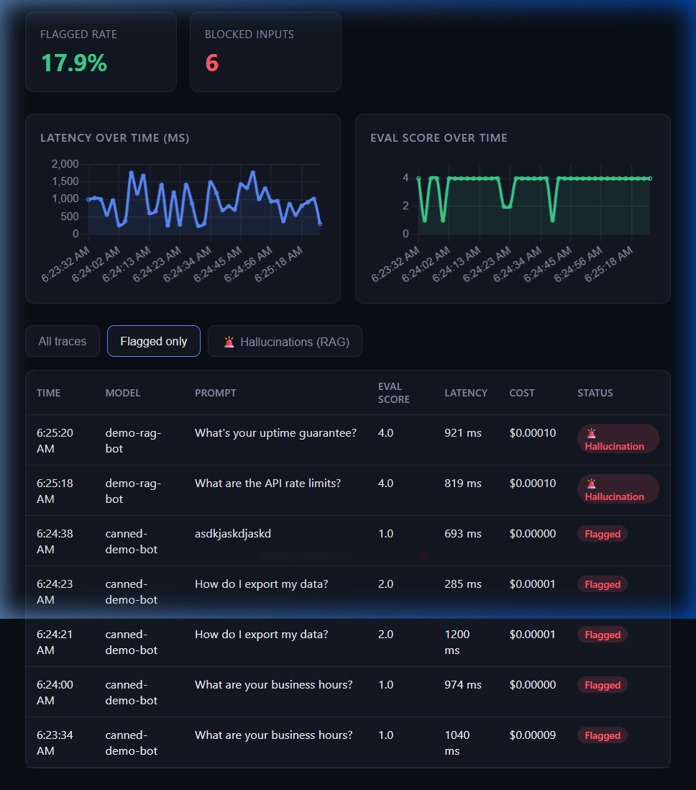

# LLM Production Monitor — Execution & Analysis Walkthrough

This document outlines the steps taken to analyze, set up, and run the **LLM Production Monitor** project on Windows. The monitor is now fully active, the database is populated, and the dashboard is serving data.

---

## 🚀 Execution Summary

The project was successfully executed in the local environment using the following steps:

1. **Virtual Environment Setup:** 
   Created an isolated Python 3.11 virtual environment in the project root to prevent package conflicts:
   ```powershell
   python -m venv .venv
   ```

2. **Dependency Installation:**
   Installed all backend dependencies (`fastapi`, `uvicorn`, `sqlalchemy`, `pydantic`, `apscheduler`, `requests`, `anthropic`, and `python-dotenv`) from [requirements.txt](file:///c:/Users/sarth/OneDrive/Documents/Desktop/llm-production-monitor/requirements.txt):
   ```powershell
   .venv\Scripts\pip.exe install -r requirements.txt
   ```

3. **Backend Server Startup:**
   Launched the FastAPI server on `127.0.0.1:8000`. The startup triggered SQLite database creation and initialized the `BackgroundScheduler` which runs the Slack alert checker loop every 5 minutes:
   ```powershell
   .venv\Scripts\uvicorn.exe app.main:app --host 127.0.0.1 --port 8000
   ```

4. **Generating General Observability Traffic:**
   Simulated 30 LLM requests (FAQ queries, PII-laden messages, prompt-injection attempts, and low-quality/empty completions) to verify the input/output guardrails and rule-based checks:
   ```powershell
   $env:PYTHONIOENCODING="utf-8"
   .venv\Scripts\python.exe scripts/demo_app.py
   ```

5. **Generating RAG-Specific Traffic (The Differentiator):**
   Simulated retrieval-augmented generation queries against a fake knowledge base to test the groundedness check and retrieval quality evaluation:
   ```powershell
   $env:PYTHONIOENCODING="utf-8"
   .venv\Scripts\python.exe scripts/demo_rag_app.py
   ```

6. **UI Validation via Browser:**
   A browser subagent navigated to `http://localhost:8000` to verify the Chart.js visualizers, stats metrics, and trace filter tables.

---

## 🔭 Live Dashboard Verification

The dashboard is fully responsive and shows the trace streams generated by the simulation scripts. Below are the visual recordings and screenshots from each view.

### 🎥 Web Demonstration
A full session recording showing page load, tab navigation, and responsive chart scaling.


---

### 📊 Dashboard Tab Views

````carousel

*Displays summary metrics (Total Traces: 37, Avg Latency: 914 ms, Avg Eval Score: 3.67/5, Flagged Rate: 17.9%, Blocked Inputs: 6), active Chart.js line charts, and the live trace table.*
<!-- slide -->

*Filters to show only requests flagged by guardrails (e.g., prompt injections, empty responses, banned words).*
<!-- slide -->

*Dedicated RAG view displaying ungrounded responses. It lists the Groundedness Score, Retrieval Score, and extracts the exact unsupported claims (e.g., invented burst allowances).*
````

---

## 🔍 Technical Analysis of the Observability Pipeline

The system is designed with four decoupled, production-inspired modules:

### 1. Ingestion & Server (`app/main.py`)
- Automatically initializes the database schema (`init_db()`).
- Launches a `BackgroundScheduler` executing alert checks in the background.
- Mounts `dashboard/index.html` at the root path (`/`) to serve the UI statically.
- The `POST /log` endpoint acts as the primary ingestion gateway, invoking input guardrails, eval pipelines, output filters, and RAG checks sequentially before committing a `Trace` record to the SQLite database.

### 2. General Evaluation (`app/evals.py`)
- **Rule-based checks:** Synchronous tests for empty responses, maximum lengths, banned words (e.g., `"idiot"`), and token repetition ratios to catch looping models.
- **LLM-as-judge (Fallback Mode):** 
  - If `ANTHROPIC_API_KEY` is configured in the environment, it makes an API request to Claude (hardcoded to `claude-haiku-4-5-20251001`) with a quality scoring prompt, returning a structured JSON response with a score (1–5) and explanation.
  - If no key is set, it falls back to a **heuristic function** that scores based on rule violations and text length so the monitor remains fully offline-compatible.

> [!NOTE]
> The Anthropic model specified in `evals.py` and `rag_evals.py` is `claude-haiku-4-5-20251001`. This is a valid, current Anthropic model identifier (Claude Haiku 4.5), meaning it will work exactly as-is without modification if you configure an active `ANTHROPIC_API_KEY`.

### 3. RAG Groundedness & Retrieval (`app/rag_evals.py`)
This is the distinguishing differentiator of the project:
- **Retrieval Quality Score:** Uses lexical token overlap between the query and the retrieved context chunks. If the overlap is low, it suggests the retriever failed to grab relevant information.
- **Groundedness Score:** Checks whether the response is fully supported by the retrieved context. 
  - In LLM-judge mode, Claude is prompted with both the retrieved context and the generated response, returning a list of any claims in the response that cannot be found in the context.
  - In heuristic mode, it tokenizes the response by sentence and verifies token overlap coverage against the context block. Sentences with less than 40% overlap are flagged as unsupported.

### 4. Input & Output Guardrails (`app/guardrails.py`)
- **Pre-Call Checks:** Scan prompts for input risks (obvious prompt-injection commands like `"ignore previous instructions"` and PII patterns like emails, phone numbers, or credit card regexes) before passing to the LLM.
- **Post-Call Checks:** Verify the completed response against the same PII patterns, rule violations, and flag any trace scoring below `2.5` on the quality evaluation.

---

## 🛠️ How You Can Run and Interact with it Now

The environment is fully configured and the server is running. You can interact with it using these details:

- **Frontend Dashboard:** Open your browser to `http://localhost:8000/` to explore the live UI.
- **FastAPI OpenAPI Swagger Docs:** Accessible at `http://localhost:8000/docs`.
- **Triggering an Alert Manually:** 
  You can execute a POST request to `/alerts/check` to evaluate the threshold checks:
  ```bash
  curl -X POST http://localhost:8000/alerts/check
  ```
- **Stopping the Server:**
  The server is running as a background job. If you wish to stop it, you can find the process or run:
  ```powershell
  Stop-Process -Id <process_id> # The process ID is shown in the uvicorn start logs (e.g. 6848)
  ```
